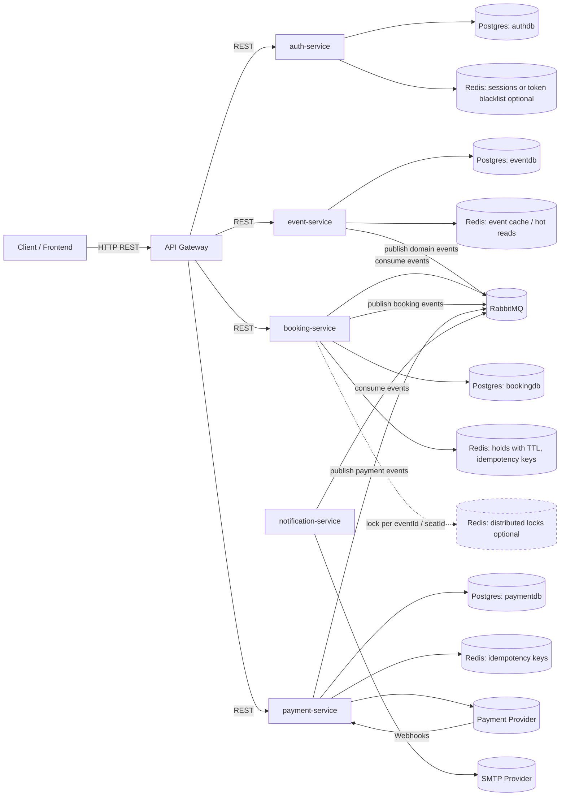
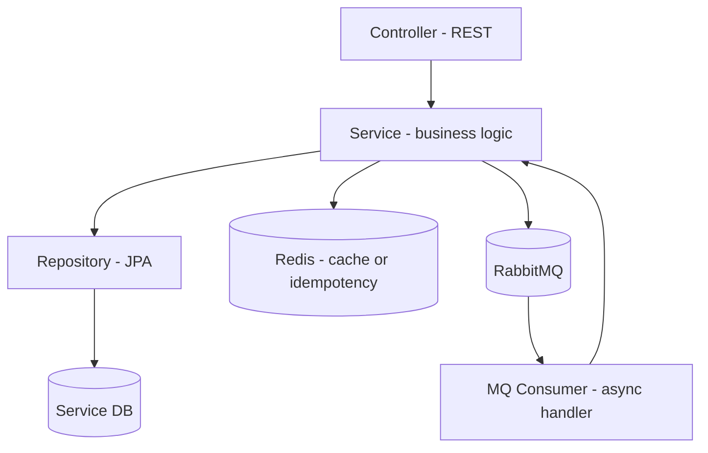
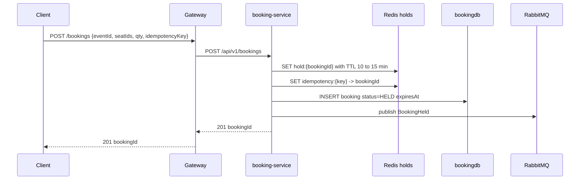
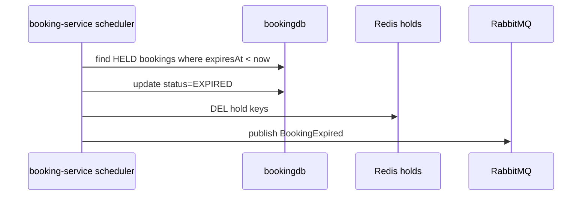
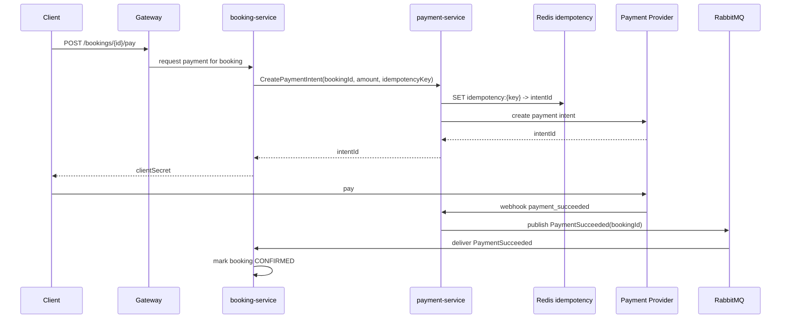

```mermaid
flowchart LR
  %% Clients
  U[Client / Frontend] -->|HTTP REST| GW[API Gateway]

  %% Auth
  GW -->|REST| AUTH[auth-service]
  AUTH --> AUTHDB[(Postgres: authdb)]
  AUTH --> AUTHREDIS[(Redis: sessions or token blacklist optional)]

  %% Event - read heavy
  GW -->|REST| EVENT[event-service]
  EVENT --> EVENTDB[(Postgres: eventdb)]
  EVENT --> EVENTCACHE[(Redis: event cache / hot reads)]
  EVENT -->|publish domain events| MQ[(RabbitMQ)]

  %% Booking - owns reservations
  GW -->|REST| BOOK[booking-service]
  BOOK --> BOOKDB[(Postgres: bookingdb)]
  BOOK --> HOLDS[(Redis: holds with TTL, idempotency keys)]
  BOOK -->|consume events| MQ
  BOOK -->|publish booking events| MQ

  %% Payment - owns payments
  GW -->|REST| PAY[payment-service]
  PAY --> PAYDB[(Postgres: paymentdb)]
  PAY --> PAYREDIS[(Redis: idempotency keys)]
  PAY --> PSP[(Payment Provider)]
  PSP -->|Webhooks| PAY
  PAY -->|publish payment events| MQ

  %% Notification - async
  NOTIF[notification-service]
  NOTIF --> SMTP[(SMTP Provider)]
  NOTIF -->|consume events| MQ

  %% Optional anti-oversell lock
  LOCKS[(Redis: distributed locks optional)]:::opt
  BOOK -. lock per eventId / seatId .-> LOCKS

  classDef opt stroke-dasharray: 5 5;
```

```mermaid
flowchart TB
  %% Typical layering inside a service
  Controller[Controller - REST] --> Service[Service - business logic]
  Service --> Repo[Repository - JPA]
  Repo --> DB[(Service DB)]

  %% Shared infra patterns
  Service --> Cache[(Redis - cache or idempotency)]
  Service --> MQ[(RabbitMQ)]
  MQ --> Consumer[MQ Consumer - async handler]
  Consumer --> Service
```

```mermaid
sequenceDiagram
    participant Client
    participant Gateway
    participant Booking as booking-service
    participant Redis as Redis holds
    participant BookingDB as bookingdb
    participant MQ as RabbitMQ

    Client->>Gateway: POST /bookings {eventId, seatIds, qty, idempotencyKey}
    Gateway->>Booking: POST /api/v1/bookings
    Booking->>Redis: SET hold:{bookingId} with TTL 10 to 15 min
    Booking->>Redis: SET idempotency:{key} -> bookingId
    Booking->>BookingDB: INSERT booking status=HELD expiresAt
    Booking->>MQ: publish BookingHeld
    Booking-->>Gateway: 201 bookingId
    Gateway-->>Client: 201 bookingId
```

```mermaid
sequenceDiagram
    participant Scheduler as booking-service scheduler
    participant BookingDB as bookingdb
    participant Redis as Redis holds
    participant MQ as RabbitMQ

    Scheduler->>BookingDB: find HELD bookings where expiresAt < now
    Scheduler->>BookingDB: update status=EXPIRED
    Scheduler->>Redis: DEL hold keys
    Scheduler->>MQ: publish BookingExpired
```

```mermaid
sequenceDiagram
    participant Client
    participant Gateway
    participant Booking as booking-service
    participant Payment as payment-service
    participant Redis as Redis idempotency
    participant PSP as Payment Provider
    participant MQ as RabbitMQ

    Client->>Gateway: POST /bookings/{id}/pay
    Gateway->>Booking: request payment for booking
    Booking->>Payment: CreatePaymentIntent(bookingId, amount, idempotencyKey)
    Payment->>Redis: SET idempotency:{key} -> intentId
    Payment->>PSP: create payment intent
    PSP-->>Payment: intentId
    Payment-->>Booking: intentId
    Booking-->>Client: clientSecret

    Client->>PSP: pay
    PSP->>Payment: webhook payment_succeeded
    Payment->>MQ: publish PaymentSucceeded(bookingId)
    MQ->>Booking: deliver PaymentSucceeded
    Booking->>Booking: mark booking CONFIRMED
```
